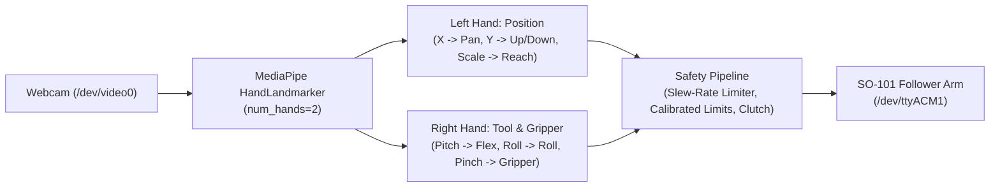

# SO-101 Dual-Hand Real-Time Teleoperation (Vision-Based)

[](https://www.python.org/downloads/)
[](LICENSE)
[](https://github.com/huggingface/lerobot)

A real-time computer vision teleoperation system for the **SO-101 (and SO-100) robotic arm**. Controls the 6-DOF arm and gripper using **TWO hands** tracked simultaneously via your laptop webcam—no physical leader arm or expensive wearable sensors required.

---

## Why Dual-Hand Teleoperation?

Controlling all 6 degrees of freedom on a single hand introduces severe mechanical coupling: rotating your wrist or squeezing your fingers unintentionally shifts your palm in space, nudging the arm off-target right when grasping.

By dividing the robot's degrees of freedom naturally between two hands, control becomes intuitive and completely decoupled:
- **Left Hand ("3D Arm Joystick")**: Focuses entirely on gross 3D spatial positioning:
  - **Move Hand Up / Down** $\rightarrow$ **Arm moves UP / DOWN** (calibrated full range of motion that fits completely inside the on-screen target box).
  - **Move Hand Left / Right** $\rightarrow$ **Arm pans Left / Right**.
  - **Push / Pull Hand** $\rightarrow$ **Arm reaches forward / retracts back**.
- **Right Hand ("End-Effector Wand")**: Focuses entirely on tool orientation and grasping:
  - **Wrist Tilt / Pitch** $\rightarrow$ **Gripper tilts Up / Down**.
  - **Wrist Roll** $\rightarrow$ **Gripper rotates CW / CCW**.
  - **Pinch Thumb & Index** $\rightarrow$ **Gripper closes (0% pinch) to open (100%)**.

*(Note: Left-handed or alternate operator preference? Press **`[S]`** to swap hand roles instantly!)*

---
## Features

- **Coordinated Height & Reach Control**: When you move your hand up/down, shoulder_lift AND elbow_flex move together using calibrated paired poses, so the arm moves in pure vertical and horizontal directions rather than individual joints.
- **Full Workspace Calibration**: Teach the arm your desk height, highest reach, most-forward extension, and most-retracted position — the system then maps your hand movement to the full 3D workspace.
- **All-in-One Startup Prompt**: Automatically asks `Do you wish to calibrate the arm workspace limits first? [y/N]` when launching with `--robot`, allowing calibration, verification, and live teleoperation in a **single command**.
- **Offline Voice Control ("On" / "Off")**: Speak **"On"** to engage the arm clutch, and **"Off"** to freeze/deactivate the arm. 100% offline, private, and zero latency via Vosk and SoundDevice.
- **Live Real-Time Motor Angle Readout**: The calibration utility streams real-time physical joint angles in your terminal as you move the arm by hand, with intelligent auto-centering safety fallbacks.
- **Custom Workspace Limits Calibration (`--calibrate-limits`)**: Interactively teach and save your desk's exact safe table-contact height, ceiling clearance, forward reach, and pan limits.
- **Safe Dry-Run Sweep (`--test-sweep`)**: Smoothly verifies all motions across your calibrated limits before live teleoperation begins.
- **Intuitive Dual-Hand Mapping**: Moving your hand **UP** makes the arm go **UP**. Pushing your hand **forward** makes the arm reach **forward**. Completely natural.
- **Full On-Screen Range of Motion**: Scaled so that moving between the visual markers (`▲ UP` and `▼ DOWN`) inside the target box commands the arm's **entire useful vertical travel** without awkward off-screen reaching.
- **Decoupled Dual-Hand Tracking**: Simultaneous 30+ FPS landmark tracking of both hands via Google MediaPipe Tasks.
- **Side-by-Side Dual-Pane UI**: Dark HUD control dashboard on the left (380px), completely unobstructed live camera view on the right (960px).
- **Dual Guided Target Boxes**: On-screen corner brackets with crosshairs, elevation guides (`▲ HIGH (UP)`, `── NEUTRAL ──`, `▼ LOW (DOWN)`), and real-time color feedback.
- **Bumpless Soft Engagement**: Software slew-rate limiter gently glides the arm from its resting position to your hand targets (~42°/sec max), preventing sudden jerks.
- **Calibrated 2D Pinch Gripper**: Ultra-sensitive pinch detection (0% fully closed to 100% open) normalized by hand scale.
- **Runtime Direction & Role Toggles**:
  - Press **`[I]`** (or `--invert-lift`) to invert lift direction if desired.
  - Press **`[S]`** (or `--swap`) to swap hand roles (`Left=Position, Right=Tool` $\leftrightarrow$ `Right=Position, Left=Tool`).
- **Press `[C]`** to re-zero the tool hand (wrist roll/pitch neutral reference).
- **Live Hardware Integration**: Seamlessly interfaces with LeRobot's `SOFollower` and Feetech STS3215 bus.

---

## System Architecture



---

## Installation & Setup

### 1. Prerequisites
- Python 3.10+
- An SO-101 or SO-100 follower arm powered and connected via USB
- A standard laptop webcam or external USB camera

### 2. Environment Setup
```bash
# Clone the repository
git clone https://github.com/MattiArlo/so101-hand-teleop.git
cd so101-hand-teleop

# Create or activate your virtual environment (e.g. conda or uv)
conda create -n so101-teleop python=3.12 -y
conda activate so101-teleop

# Install dependencies
pip install -r requirements.txt
```

---

---

## Quickstart: All-in-One Command

You can do **everything in a single command**! When launching with `--robot`, the system asks if you want to calibrate first:

```bash
python visualizer.py --robot --port /dev/ttyACM1
```

```text
Do you wish to calibrate the arm workspace limits first? [y/N]:
```

- Type **`y`**: It disables motor torque, shows **live real-time motor angles** in the terminal, walks you through teaching desk contact and highest reach, optionally runs a test sweep, and then seamlessly launches teleoperation!
- Type **`n`** (or press **`[ENTER]`**): Automatically loads your saved `arm_limits.json` and immediately launches the teleoperation dashboard.
- Add `--no-prompt` to always jump straight to teleoperation without asking.

*(Simulation only? Just run `python visualizer.py` without `--robot` to test hand tracking in the HUD).*

---

## Voice Control & Hands-Free Operation

No need to stay tethered to the keyboard! The system includes a **100% offline, zero-latency speech listener** (powered by Vosk):
- **Speak "On"** $\rightarrow$ Activates the arm clutch. The robot immediately starts mirroring your hand gestures.
- **Speak "Off"** $\rightarrow$ Deactivates/freezes the arm in place safely.
- *Status indicator*: The left HUD dashboard displays `VOICE: ON (Listening)` or `VOICE: OFF` in real time.

---

## Workspace Calibration & Verification

Every desk height, mounting clamp, and workspace differs. The calibration utility ensures the arm never hits your desk or cables, and that 100% of your hand motion maps directly to your physical workspace:

### 1. Live Terminal Calibration Readout
When calibrating (either at startup or via `python visualizer.py --calibrate-limits --port /dev/ttyACM1`), motor torque is disabled and the terminal streams live angles as you move the arm:
```text
  Pan:  12.4  Lift:  48.2  Elbow:  64.1
```
- **Step 1 (Lowest Pick Position)**: Guide the gripper to touch your table surface $\rightarrow$ press **`[ENTER]`**.
- **Step 2 (Highest Reach)**: Move the arm to its highest safe clearance in the air $\rightarrow$ press **`[ENTER]`**.
- **Step 3 (Neutral Pose)**: Move to your comfortable resting pose $\rightarrow$ press **`[ENTER]`**.
- **Step 4 (Fully Extended Forward)**: Extend the arm as far forward as it can safely reach $\rightarrow$ press **`[ENTER]`**.
- **Step 5 (Retracted Close to Base)**: Pull the arm close to the base with elbow bent $\rightarrow$ press **`[ENTER]`**.
- **Step 6 (Pan Range)**: Move to your leftmost and rightmost workspace bounds $\rightarrow$ press **`[ENTER]`**.
- **Step 7 (Gripper)**: Squeeze closed and open fully $\rightarrow$ press **`[ENTER]`**.

*Safety Features*: Includes auto-centering protection (ensuring neutral pose stays strictly between up and down even if the arm drops under gravity) and auto-symmetric pan bounds.

### 2. Gentle Test Sweep
After calibration (or by passing `--test-sweep`), the arm gently sweeps through its limits:
```bash
python visualizer.py --robot --test-sweep --port /dev/ttyACM1
```
The arm cycles: `Neutral` $\rightarrow$ `High Reach` $\rightarrow$ `Low Desk` $\rightarrow$ `Left/Right Pan` $\rightarrow$ `Gripper Cycle`.

---

## Control Mapping

### Left Hand: Arm Position (3-DOF)
| Hand Gesture | Effect | Joints Moved |
|---|---|---|
| **Move Hand Up / Down** | **Arm goes UP / DOWN** (pure height change) | `shoulder_lift` + `elbow_flex` (coordinated pair) |
| **Move Hand Left / Right** | Base rotation left or right ($\pm 60^\circ$) | `shoulder_pan` |
| **Push Hand Toward Camera** | **Arm reaches FORWARD** (extends) | `shoulder_lift` + `elbow_flex` (coordinated pair) |
| **Pull Hand Away from Camera** | **Arm retracts BACKWARD** (close to base) | `shoulder_lift` + `elbow_flex` (coordinated pair) |

### Right Hand: Wrist Orientation & Gripper (3-DOF)
| Hand Gesture | Controlled Joint | Description |
|---|---|---|
| **Tilt Wrist Down / Up** | `wrist_flex` | Gripper pitch tilt ($\pm 75^\circ$) |
| **Rotate Palm Clockwise / CCW** | `wrist_roll` | Gripper roll rotation ($\pm 170^\circ$) |
| **Pinch Thumb & Index Tips Together** | `gripper` | Closes gripper (0% pinch) |
| **Separate Thumb & Index Apart** | `gripper` | Opens gripper (100% open) |

---

## How to Operate

1. **Launch the visualizer** with `--robot --port /dev/ttyACM1` (or in simulation mode first).
2. **Hold your hands in front of the camera**:
   - Place your **Left Hand** inside the left target box on screen.
   - Place your **Right Hand** inside the right target box on screen.
3. Observe both target boxes turn **glowing green** (`READY: Neutral Zone`).
4. **Engage Clutch (Voice or Keyboard)**:
   - **Voice**: Speak **"On"** into your microphone to engage tracking; speak **"Off"** to disengage and freeze.
   - **Keyboard**: Hold **`[SPACE]`** for momentary clutch (arm moves while held, freezes when released), or press **`[T]`** to toggle continuous mode.
   - The arm smoothly glides into alignment via the slew-rate limiter.
5. **Move your left hand** to control the arm:
   - Move **UP / DOWN** $\rightarrow$ arm height goes UP / DOWN.
   - Move **LEFT / RIGHT** $\rightarrow$ arm base rotates left / right.
   - Push **TOWARD camera** $\rightarrow$ arm extends forward. Pull **AWAY** $\rightarrow$ arm retracts.
6. **Use your right hand** to control the gripper:
   - **Pinch** thumb and index $\rightarrow$ gripper closes. **Separate** $\rightarrow$ gripper opens.
   - **Rotate** your wrist $\rightarrow$ gripper rotates.
   - **Tilt** your wrist up/down $\rightarrow$ gripper pitches up/down.

---

## Controls, Voice Commands & Shortcuts

| Input | Action | Description |
|---|---|---|
| **Voice "On"** | Engage Arm | Activates arm tracking hands-free |
| **Voice "Off"** | Disengage Arm | Deactivates arm tracking and holds position |
| **`[SPACE]`** (Hold) | Clutch Hold | Drive arm while held, freeze on release |
| **`[T]`** | Toggle Clutch | Toggle continuous tracking ON / OFF |
| **`[C]`** | Zero Tool Hand | Re-zero wrist roll/pitch neutral for tool hand |
| **`[I]`** | Invert Lift | Invert vertical lift direction (`Up` $\leftrightarrow$ `Down`) |
| **`[S]`** | Swap Roles | Swap hand roles (`Left=Pos, Right=Tool` $\leftrightarrow$ `Right=Pos, Left=Tool`) |
| **`[Q]`** / **`[ESC]`** | Exit | Exit application and safely disable arm torque |

---

## CLI Options

| Argument | Description | Default |
|---|---|---|
| `--robot` | Connect to physical SO-101 follower arm | `False` |
| `--port` | Robot serial port | `/dev/ttyACM1` |
| `--no-prompt` | Skip the startup calibration question and jump straight in | `False` |
| `--calibrate-limits` | Launch interactive workspace limits calibration | `False` |
| `--test-sweep` | Run a safe test sweep before teleoperation | `False` |
| `--limits-file` | Path to custom workspace limits JSON | `arm_limits.json` |
| `--swap` | Swap hand roles (Right=Position, Left=Tool) | `False` |
| `--invert-lift` | Invert vertical elevation direction | `False` |
| `--camera` | Webcam device index | `0` |

---

## License

This project is licensed under the Apache 2.0 License.
