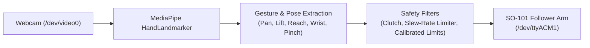

# SO-101 Real-Time Hand Teleoperation (Vision-Based)

[](https://www.python.org/downloads/)
[](LICENSE)
[](https://github.com/huggingface/lerobot)

A real-time computer vision teleoperation system for the **SO-101 (and SO-100) robotic arm**. Control the 6-DOF arm and gripper using only your laptop webcam and right-hand gestures—no physical leader arm or expensive wearable sensors required.

---

## Features

- **Webcam-Based Gesture Tracking**: 30+ FPS landmark tracking using Google MediaPipe Tasks.
- **Physical Handedness Recognition**: Detects true physical right vs. left hand, with on-screen mirroring for intuitive hand-eye coordination.
- **Side-by-Side Dual-Pane UI**: Dark HUD control dashboard on the left (380px), completely unobstructed live camera view on the right.
- **Resizable Window**: Window uses `cv2.WINDOW_NORMAL`—drag borders to resize or expand to full screen.
- **Bumpless Soft Engagement**: Software slew-rate limiter gently glides the arm from its resting position to your hand pose (~35°/sec max), preventing sudden jerks or snaps.
- **Center "Neutral Target Box"**: Guided startup area with visual crosshairs and color feedback (`READY: Hand in Neutral Zone`).
- **Responsive 2D Pinch Gripper**: Sensitive pinch detection that closes cleanly to 0% and opens smoothly to 100%.
- **Live Hardware Integration**: Seamlessly interfaces with LeRobot's `SOFollower` and Feetech STS3215 bus.

---

## System Architecture



---

## Installation & Setup

### 1. Prerequisites
- Python 3.10+
- An SO-101 or SO-100 follower arm powered and connected via USB
- A standard laptop webcam or USB camera

### 2. Environment Setup
```bash
# Clone the repository
git clone https://github.com/MattiArlo/so101-hand-teleop.git
cd so101-hand-teleop

# Create or activate your virtual environment (e.g. conda or uv)
conda create -n so101-teleop python=3.12 -y
conda activate so101-teleop

# Install dependencies
pip install -r requirements.txt
```

---

## Quickstart

### 1. Simulation Mode (Safe Test without Robot)
Run the visualizer to test tracking and familiarize yourself with the gestures:
```bash
python visualizer.py
```

### 2. Live Follower Arm Control
When ready to control the physical robot, add `--robot`:
```bash
python visualizer.py --robot --port /dev/ttyACM1
```

*(Note: You can also use `python teleoperate.py`)*

---

## How to Operate the Arm Correctly

1. **Launch the application** with `--robot --port /dev/ttyACM1`.
2. **Hold your right hand inside the center target box** on screen with your palm facing the camera.
3. Observe the box turn **glowing green** (`READY: Hand in Neutral Zone`).
4. **Press `[C]`** on your keyboard to set your current hand position and depth as the zero/neutral reference pose.
5. **Hold `[SPACE]`** (or press **`[T]`** to toggle continuous tracking):
   - The clutch badge turns **Green (`[ CLUTCH ENGAGED - ACTIVE ]`)**.
   - The arm will **gently and smoothly glide** into sync with your hand.
6. **Move your hand** to control the arm:

| Gesture | Robot Motion |
|---|---|
| **Move Hand Left / Right** | Rotates base (`shoulder_pan`) |
| **Move Hand Up / Down** | Lifts arm up or down (`shoulder_lift`) |
| **Push Hand Closer to Camera** | Extends reach forward (`elbow_flex`) |
| **Pull Hand Back Towards Body** | Retracts elbow (`elbow_flex`) |
| **Rotate Palm Clockwise / Counter-Clockwise** | Rotates wrist (`wrist_roll`) |
| **Tilt Fingers Down / Up** | Tilts gripper pitch (`wrist_flex`) |
| **Pinch Thumb & Index Tips Together** | Closes gripper (0% pinch) |
| **Separate Thumb & Index** | Opens gripper (100% open) |

---

## Keyboard Shortcuts

| Key | Function |
|---|---|
| **`[SPACE]`** (Hold) | Engage clutch (streams motion to follower arm) |
| **`[T]`** | Toggle continuous tracking ON / OFF |
| **`[C]`** | Re-zero / calibrate current hand position as neutral `(0, 0)` |
| **`[H]`** | Swap target hand (`Right` $\leftrightarrow$ `Left`) |
| **`[Q]`** or **`[ESC]`** | Exit application and safely disable arm torque |

---

## License

This project is licensed under the Apache 2.0 License.
