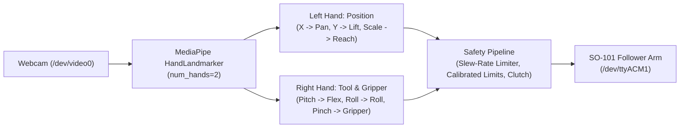

# SO-101 Dual-Hand Real-Time Teleoperation (Vision-Based)

[](https://www.python.org/downloads/)
[](LICENSE)
[](https://github.com/huggingface/lerobot)

A real-time computer vision teleoperation system for the **SO-101 (and SO-100) robotic arm**. Controls the 6-DOF arm and gripper using **TWO hands** tracked simultaneously via your laptop webcam—no physical leader arm or expensive wearable sensors required.

---

## Why Dual-Hand Teleoperation?

Controlling all 6 degrees of freedom on a single hand introduces severe mechanical coupling: rotating your wrist or squeezing your fingers unintentionally shifts your palm in space, nudging the arm off-target right when grasping.

By dividing the robot's degrees of freedom naturally between two hands, control becomes intuitive and completely decoupled:
- **Left Hand ("3D Arm Joystick")**: Focuses entirely on gross 3D spatial positioning (Pan, Lift, Reach). You can keep an open, relaxed hand without worrying about wrist roll or pinching.
- **Right Hand ("End-Effector Wand")**: Focuses entirely on tool orientation and grasping (Wrist Flex, Wrist Roll, Gripper Pinch). Rotating or pinching your right fingers never affects the arm's 3D position!

*(Note: Left-handed or alternate operator preference? Press **`[S]`** to swap hand roles instantly!)*

---

## Features

- **Decoupled Dual-Hand Tracking**: Simultaneous 30+ FPS landmark tracking of both hands via Google MediaPipe Tasks.
- **Natural Degree-of-Freedom Division**:
  - **Left Hand**: `shoulder_pan`, `shoulder_lift`, `elbow_flex` (3-DOF Arm Position)
  - **Right Hand**: `wrist_flex`, `wrist_roll`, `gripper` (3-DOF Tool & Grasp)
- **Side-by-Side Dual-Pane UI**: Dark HUD control dashboard on the left (380px), completely unobstructed live camera view on the right (960px).
- **Dual Guided Neutral Target Boxes**: On-screen corner brackets with crosshairs and real-time color feedback (`READY: Neutral Zone`).
- **Bumpless Soft Engagement**: Software slew-rate limiter gently glides the arm from its resting position to your hand targets (~42°/sec max), preventing sudden jerks.
- **Calibrated 2D Pinch Gripper**: Ultra-sensitive pinch detection (0% fully closed to 100% open) normalized by hand scale.
- **Role Swap Support**: Toggle between `Left=Position, Right=Tool` and `Right=Position, Left=Tool` at runtime with `[S]` or CLI flag `--swap`.
- **Independent Calibration**: Press `[C]` to zero both hands simultaneously (or calibrate whichever hand is currently in frame).
- **Live Hardware Integration**: Seamlessly interfaces with LeRobot's `SOFollower` and Feetech STS3215 bus.

---

## System Architecture



---

## Installation & Setup

### 1. Prerequisites
- Python 3.10+
- An SO-101 or SO-100 follower arm powered and connected via USB
- A standard laptop webcam or external USB camera

### 2. Environment Setup
```bash
# Clone the repository
git clone https://github.com/MattiArlo/so101-hand-teleop.git
cd so101-hand-teleop

# Create or activate your virtual environment (e.g. conda or uv)
conda create -n so101-teleop python=3.12 -y
conda activate so101-teleop

# Install dependencies
pip install -r requirements.txt
```

---

## Quickstart

### 1. Simulation Mode (Safe Test without Robot)
Run the visualizer to test tracking and familiarize yourself with two-handed control:
```bash
python visualizer.py
```

### 2. Live Follower Arm Control
When ready to control the physical robot, add `--robot`:
```bash
python visualizer.py --robot --port /dev/ttyACM1
```

*(Note: `python teleoperate.py` is also available as a convenience launcher)*

---

## Control Mapping

### Left Hand: Arm Position (3-DOF)
| Hand Gesture | Controlled Joint | Description |
|---|---|---|
| **Move Hand Left / Right** | `shoulder_pan` | Rotates base yaw left or right ($\pm 55^\circ$) |
| **Move Hand Up / Down** | `shoulder_lift` | Elevates or lowers the main arm |
| **Push Hand Closer to Camera** | `elbow_flex` | Extends arm reach forward |
| **Pull Hand Back Away from Camera** | `elbow_flex` | Retracts arm back towards base |

### Right Hand: Wrist Orientation & Gripper (3-DOF)
| Hand Gesture | Controlled Joint | Description |
|---|---|---|
| **Tilt Wrist Down / Up** | `wrist_flex` | Gripper pitch tilt ($\pm 75^\circ$) |
| **Rotate Palm Clockwise / CCW** | `wrist_roll` | Gripper roll rotation ($\pm 170^\circ$) |
| **Pinch Thumb & Index Tips Together** | `gripper` | Closes gripper (0% pinch) |
| **Separate Thumb & Index Apart** | `gripper` | Opens gripper (100% open) |

---

## How to Operate

1. **Launch the visualizer** with `--robot --port /dev/ttyACM1` (or in simulation mode first).
2. **Hold your hands in front of the camera**:
   - Place your **Left Hand** inside the left target box on screen.
   - Place your **Right Hand** inside the right target box on screen.
3. Observe both target boxes turn **glowing green** (`READY: Neutral Zone`).
4. **Press `[C]`** on your keyboard:
   - Sets your current left hand position/depth as the arm position neutral zero.
   - Sets your current right hand roll and tilt as the wrist neutral reference.
5. **Engage Clutch**:
   - **Hold `[SPACE]`** for momentary clutch (arm moves while held, freezes when released).
   - Or **press `[T]`** to toggle continuous teleoperation mode.
   - The arm smoothly glides into alignment via the slew-rate limiter.
6. **Operate**: Move your left hand in 3D to place the arm in space; use your right hand to orient the gripper and pinch to grasp objects!

---

## Keyboard Shortcuts

| Key | Function |
|---|---|
| **`[SPACE]`** (Hold) | Engage clutch (streams motion to follower arm) |
| **`[T]`** | Toggle continuous tracking ON / OFF |
| **`[C]`** | Calibrate / zero neutral reference poses for both hands |
| **`[S]`** | Swap hand roles (`Left=Position, Right=Tool` $\leftrightarrow$ `Right=Position, Left=Tool`) |
| **`[Q]`** or **`[ESC]`** | Exit application and safely disable arm torque |

---

## License

This project is licensed under the Apache 2.0 License.
